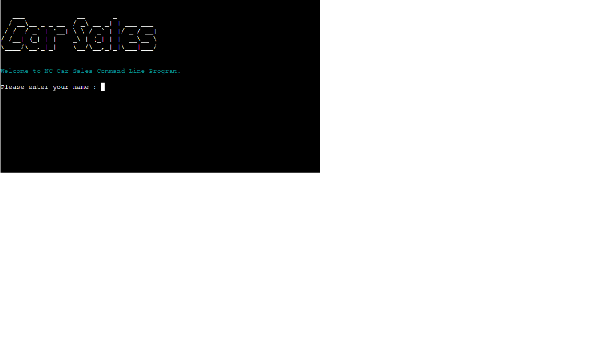

# NC Car Sales Command Line Program

## Live Link - <https://nc-car-sales.herokuapp.com/>

## Background

The Car sales is my third Milestone Project, this time using Python to create a CLI which uses an API to access data from an external Google sheet with cars for sale details,
this program allows the user to access two sides to the program, the customer side which is viewing available stock of cars from a fictional Japanese based car dealership, or the
staff section which requires a password to enter ("carsales") and then allows the user to enter a car into the database. The program has several loops and data validation to create
a fully accessible application.

## User Experience (UX)

### User Story & Target Audience

#### First Time Visitor Goals

- I want to be able to enter some personal namely detail
- I want to be able to define what type of user i am, and access the relevant part
- I want to be able to access cars for sale data (customer)
- I want to be able to filter the cars i want to see
- I want to be able to login and access protected parts of the program
- I want to be able to input new stock into the program

#### Target Audience

- The Target Audience for this APP is aimed at but not limited to anyone which would be looking to buy a car from this fictional car dealership. The app is made in a way to be multi-functional
by being able to choose which user route you want to go down at the beginning of the program.

## Design

### Colour Scheme

- Due to this being a terminal, design is limited.
- I have used different font colours to improve readability and group text subjects into colours.

### Font

- I have added ASCII Art into the CLI for the main loading text, again to spruce up the terminal. With the intention to provide a unique user interface.

- Different font colours are used throughout the terminal, which have been imported from the python library TermColor

## Layout and Functionality of the CLI

### The first terminal loading stage -

You are greeted with the ASCII Art Car Sales logo as such, with then an input to enter your name as the user,
this input will only accept alphabetical characters either lowercase or uppercase as programmed by the developer for validation.

 

